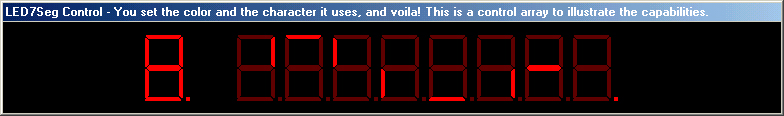



## LED 7 Segment Control 1\.2

### Description

NEW UPDATE! I have now made it so you can use an 8 character string to effectively "turn on" certain segments in the display!! It includes ALL the functionality as the previous versions as well! CHECK IT OUT. Please vote.
 
### More Info
 

             |
---                |---
**Submitted On**   |2002-07-07 22:18:48
**By**             |[James W\. Manning](https://github.com/Planet-Source-Code/PSCIndex/blob/master/ByAuthor/james-w-manning.md)
**Level**          |Intermediate
**User Rating**    |4.0 (8 globes from 2 users)
**Compatibility**  |VB 6\.0
**Category**       |[Custom Controls/ Forms/  Menus](https://github.com/Planet-Source-Code/PSCIndex/blob/master/ByCategory/custom-controls-forms-menus__1-4.md)
**World**          |[Visual Basic](https://github.com/Planet-Source-Code/PSCIndex/blob/master/ByWorld/visual-basic.md)
**Archive File**   |[LED\_7\_Segm103253772002\.zip](https://github.com/Planet-Source-Code/james-w-manning-led-7-segment-control-1-2__1-36698/archive/master.zip)

